<div align="center">

<!-- Celestial Animated Banner (SVG) -->
<a href="https://alkaid.live">
  
</a>

<br/>

<!-- Terminal Runtime Status (SVG) -->


<br/>

<p align="center">
  <a href="https://alkaid.live"></a>
  <a href="https://github.com/AlkaidSTART/call-code"></a>
  <a href="https://simple-design-zeta.vercel.app"></a>
  <a href="https://juejin.cn/user/3780587447942084"></a>
</p>

</div>

---

### 🌌 北斗七星 · 极客星宿谱 `[点击展开探索]`

> *“Alkaid（摇光）· 北斗之末 · 破军之位。每颗星辰，对应造物的一维法则。”*

<details>
<summary>⭐ <b>01. 天枢 · Dubhe</b> ── 前端全景：React & Vue 双核工程化与底层机理</summary>
<br/>

- 深度掌握 **React**（Fiber 架构、调度机制、Hooks 状态模型）与 **Vue**（响应式原理、组合式 API）
- 追求极致的组件抽象与工程构建效率（Vite, Next.js, Turborepo）
- 深入源码探究运行本质，让每一次状态变更与界面渲染都清晰可控
</details>

<details>
<summary>⭐ <b>02. 天璇 · Merak</b> ── 数据血脉：异步状态与响应式数据流</summary>
<br/>

- 娴熟驾驭 **TanStack Query**（自动缓存、后台轮询、乐观更新）与 **Zustand**（轻量原子化状态）
- 追求“让客户端数据流如同溪流般平滑自然，无卡顿、无冗余请求”
</details>

<details>
<summary>⭐ <b>03. 天玑 · Phecda</b> ── 高能服务端：Go (Gin) 微服务 & Python (FastAPI) 异步后端</summary>
<br/>

- **Go + Gin**：构建高并发、轻量级、低延迟的网络服务与微服务基建
- **Python + FastAPI**：打造高性能现代异步 API，作为 AI 与数据工程的坚实底座
</details>

<details>
<summary>⭐ <b>04. 天权 · Megrez</b> ── 智能编排：LangChain & LangGraph 多智能体协同</summary>
<br/>

- 深入实践 **LangChain** 链式编排与 **LangGraph** 有向图复杂状态机
- 设计具备循环反思、人机回环（Human-in-the-loop）、多 Agent 协作流的生产级智能体体系
</details>

<details>
<summary>⭐ <b>05. 玉衡 · Alioth</b> ── 造物工坊：自然语言驱动的 CLI Coding Agent 与产品矩阵</summary>
<br/>

- 主导开发 [**call-code**](https://github.com/AlkaidSTART/call-code) ── 基于 TypeScript + Ink 构建的本地终端编程智能体
- 支持自然语言驱动全盘文件读写、上下文长期记忆、自主任务规划与命令执行
- 打造 [**simple-design**](https://simple-design-zeta.vercel.app) ── 缩短“灵感”到“成品”的设计工具
</details>

<details>
<summary>⭐ <b>06. 开阳 · Mizar</b> ── 思考坐标：深度技术长文沉淀</summary>
<br/>

- 独立站点：[**alkaid.live**](https://alkaid.live)
- 精品长文：
  - 📖 [深入浅出 React Hooks 原理：从 Fiber 的 memoizedState 链表讲到 updateQueue 调度](https://alkaid.live/blog/react-hooks/)
  - ⚡ [TanStack Query 技术指南：异步状态管理核心实践](https://alkaid.live/blog/TanStack%20Query%20%E6%8A%80%E6%9C%AF%E6%8C%87%E5%8D%97%EF%BC%9A%E5%BC%82%E6%AD%A5%E7%8A%B6%E6%80%81%E7%AE%A1%E7%90%86%E6%A0%B8%E5%BF%83%E5%AE%9E%E8%B7%B5/)
  - 🧩 [0 基础入门 Zustand：新手友好的 React 状态管理方案](https://alkaid.live/blog/0%20%E5%9F%BA%E7%A1%80%E5%85%A5%E9%97%A8%20Zustand%EF%BC%9A%E6%96%B0%E6%89%8B%E5%8F%8B%E5%A5%BD%E7%9A%84%20React%20%E7%8A%B6%E6%80%81%E7%AE%A1%E7%90%86%E6%A0%B8%E5%BF%83%E6%96%B9%E6%A1%88/)
</details>

<details>
<summary>⭐ <b>07. 摇光 · Alkaid</b> ── 破军星动：全栈造物者，把想法变成现实</summary>
<br/>

- “北斗之末，仰望星空，脚踏实地。”
- 不设边界，写代码、做产品、折腾新奇有趣的玩具，创造触手可及的温度与价值 ✨
</details>

---

### 🎲 极客互动盲盒 `[点击翻牌]`

<table>
<tr>
<td width="50%" valign="top">

<details>
<summary>🥠 <b>抽取今日极客签文</b></summary>

```yaml
今日运势: 大吉（代码如丝般顺滑）
宜: 重构祖传屎山, 封装优雅 Hook, 按时下班
忌: 周五傍晚推生产, 不加注释的正则黑魔法
彩蛋: 此时仰望星空 30 秒，灵感 +99%
```

</details>

</td>
<td width="50%" valign="top">

<details>
<summary>🪵 <b>赛博功德 & 0 Bug 发生器</b></summary>

```
  ┌───────────────────────────┐
  │   [ 赛博木鱼 · 咚！ ]     │
  │   功德 +1 · 内存泄漏 -10MB │
  │   Bug 概率 -99.9%         │
  │   头发茂密度 +100% ✨      │
  └───────────────────────────┘
```

</details>

</td>
</tr>
</table>

---

### 🔥 代表造物 & 代表作

| 标志 | 项目 | 领域 | 核心亮点 | 链接 |
|:---:|:---|:---|:---|:---:|
| 🤖 | **call-code** | AI & CLI Agent | 基于 TypeScript + Ink 的终端编程 Agent，支持自然语言操纵项目文件与长效记忆 | [GitHub](https://github.com/AlkaidSTART/call-code) |
| 🎨 | **simple-design** | Design & SaaS | 设计即成品的轻量设计工具，所见即所得快速出图 | [在线体验](https://simple-design-zeta.vercel.app) |
| 🪐 | **alkaid.live** | Blog & Knowledge | 个人思考博客，深度沉淀前端底层原理、AI 探索与产品手记 | [进入星系](https://alkaid.live) |

---

### 🛠️ 技术装备库 (Arsenal)

<p align="left">
  <!-- Frontend -->
  <b>Frontend:</b><br/>
  
  
  
  
  
  
  
  
  <br/><br/>
  <!-- Backend -->
  <b>Backend &amp; High-Concurrency:</b><br/>
  
  
  
  
  
  
  
  <br/><br/>
  <!-- AI & Agents -->
  <b>AI &amp; Agent Engineering:</b><br/>
  
  
  
  
  <br/><br/>
  <!-- Cloud & DevOps -->
  <b>Cloud &amp; DevOps:</b><br/>
  
  
  
</p>

---

### 📊 开发者全息雷达

<div align="center">
  
  
</div>

<br/>

<div align="center">
  <sub>✨ <i>"Gaze at the stars, yet stay grounded."</i> · 持续把想法变成现实中...</sub>
</div>
