<!-- Celestial Animated Banner (SVG) -->

  

  
  
  
  
  
  

<!-- Real-time GitHub API Telemetry Capsule Bar -->

  
  
  
  
  

---

### 🌌 北斗七星 · 极客星宿谱 `[点击展开探索]`

> *“Alkaid（摇光）· 北斗之末 · 破军之位。每颗星辰，对应造物的一维法则。”*

⭐ <b>01. 天枢 · Dubhe</b> ── 前端与跨端全景：React & Vue 双核、多端工程化与底层机理

 

- 深度掌握 **React**（Fiber 架构、调度机制、Hooks 状态模型）与 **Vue**（响应式原理、组合式 API）
- 追求极致的组件抽象与工程构建效率（Vite, Next.js, Turborepo，现代包管理 Bun / pnpm / npm）
- 全端覆盖实践：掌握 **Flutter**、**uni-app** 跨平台应用开发，以及 **Tauri 2**、**Electron** 桌面端轻量高效构建
- 深入源码探究运行本质，让每一次状态变更与界面渲染都清晰可控

⭐ <b>02. 天璇 · Merak</b> ── 数据血脉：异步状态与响应式数据流

 

- 娴熟驾驭 **TanStack Query**（自动缓存、后台轮询、乐观更新）与 **Zustand**（轻量原子化状态）
- 追求“让客户端数据流如同溪流般平滑自然，无卡顿、无冗余请求”

⭐ <b>03. 天玑 · Phecda</b> ── 高能服务端：Go (Gin) 微服务 & Python (FastAPI) 异步后端

 

- **Go + Gin**：构建高并发、轻量级、低延迟的网络服务与微服务基建
- **Python + FastAPI**：打造高性能现代异步 API，作为 AI 与数据工程的坚实底座
- **现代持久化与 BaaS**：熟练运用 **PostgreSQL**、**MySQL**、**SQLite**、**Redis**、**MongoDB**，协同 **Prisma** / **TypeORM** 与 **Supabase** 平台高效构筑数据中枢

⭐ <b>04. 天权 · Megrez</b> ── 智能编排：LangChain & LangGraph 多智能体协同

 

- 深入实践 **LangChain** 链式编排与 **LangGraph** 有向图复杂状态机
- 设计具备循环反思、人机回环（Human-in-the-loop）、多 Agent 协作流的生产级智能体体系

⭐ <b>05. 玉衡 · Alioth</b> ── 造物工坊：自然语言驱动的 CLI Coding Agent 与产品矩阵

 

- 主导开发 [**call-code**](https://github.com/AlkaidSTART/call-code) ── 基于 TypeScript + Ink 构建的本地终端编程智能体
- 开源 [**coderelay**](https://github.com/AlkaidSTART/coderelay) ── 多 Coding Agent 智能路由网关与交互式 TUI，任务自适应调度并接管 TTY 会话
- 深度实践主流与前沿 Coding 平台体系（Claude Code, Codex, Antigravity, GitHub Copilot, Pi, OMP），打通终端代理与会话调度
- 支持自然语言驱动全盘文件读写、上下文长期记忆、自主任务规划与命令执行
- 打造 [**simple-design**](https://simple-design-zeta.vercel.app) ── 缩短“灵感”到“成品”的设计工具
- 开源阵地 / Gitee：[**ALIOTHK**](https://gitee.com/ALIOTHK)

⭐ <b>06. 开阳 · Mizar</b> ── 思考坐标：深度技术长文沉淀

 

- 独立站点：[**alkaid.live**](https://alkaid.live)
- 精品长文：
  - 📖 [深入浅出 React Hooks 原理：从 Fiber 的 memoizedState 链表讲到 updateQueue 调度](https://alkaid.live/blog/react-hooks/)
  - ⚡ [TanStack Query 技术指南：异步状态管理核心实践](https://alkaid.live/blog/TanStack%20Query%20%E6%8A%80%E6%9C%AF%E6%8C%87%E5%8D%97%EF%BC%9A%E5%BC%82%E6%AD%A5%E7%8A%B6%E6%80%81%E7%AE%A1%E7%90%86%E6%A0%B8%E5%BF%83%E5%AE%9E%E8%B7%B5/)
  - 🧩 [0 基础入门 Zustand：新手友好的 React 状态管理方案](https://alkaid.live/blog/0%20%E5%9F%BA%E7%A1%80%E5%85%A5%E9%97%A8%20Zustand%EF%BC%9A%E6%96%B0%E6%89%8B%E5%8F%8B%E5%A5%BD%E7%9A%84%20React%20%E7%8A%B6%E6%80%81%E7%AE%A1%E7%90%86%E6%A0%B8%E5%BF%83%E6%96%B9%E6%A1%88/)

⭐ <b>07. 摇光 · Alkaid</b> ── 破军星动：全栈造物者，把想法变成现实

 

- “北斗之末，仰望星空，脚踏实地。”
- 不设边界，写代码、做产品、折腾新奇有趣的玩具，创造触手可及的温度与价值 ✨

---

### 🔥 代表造物 & 代表作

<!-- GitHub Real-time Pinned Repo Cards API -->

  
  &nbsp;&nbsp;
  

 

| 标志 | 项目 | 领域 | 核心亮点 | 实时状态 & 链接 |
|:---:|:---|:---|:---|:---|
| 🤖 | **call-code** | AI & CLI Agent | 基于 TypeScript + Ink 的终端编程 Agent，支持自然语言操纵项目文件与长效记忆 |   |
| 🔀 | **coderelay** | AI & Agent Router | 多 Coding Agent 智能路由网关与交互式 TUI，根据任务特征分发调度并接管 TTY 会话 |   |
| 🎨 | **simple-design** | Design & SaaS | 设计即成品的轻量设计工具，所见即所得快速出图 | [在线体验](https://simple-design-zeta.vercel.app) |
| 🪐 | **alkaid.live** | Blog & Knowledge | 个人思考博客，深度沉淀前端底层原理、AI 探索与产品手记 | [进入星系](https://alkaid.live) |

---

### 🛠️ 技术装备库 (Arsenal)

  <!-- Languages -->
  <b>Languages:</b> 
  
  
  
  
    
  <!-- Frontend -->
  <b>Frontend:</b> 
  
  
  
  
  
  
  
  
    
  <!-- Cross-Platform & Desktop -->
  <b>Cross-Platform &amp; Desktop:</b> 
  
  
  
  
    
  <!-- Package Managers -->
  <b>Package Managers:</b> 
  
  
  
    
  <!-- Backend -->
  <b>Backend &amp; High-Concurrency:</b> 
  
  
  
  
  
  
    
  <!-- Databases & Storage -->
  <b>Databases &amp; Storage:</b> 
  
  
  
  
  
    
  <!-- ORM & BaaS -->
  <b>ORM &amp; BaaS:</b> 
  
  
  
    
  <!-- AI Coding Platforms -->
  <b>AI Coding Platforms:</b> 
  
  
  
  
  
  
    
  <!-- AI & Agents -->
  <b>AI &amp; Agent Engineering:</b> 
  
  
  
  
    
  <!-- Cloud & DevOps -->
  <b>Cloud &amp; DevOps:</b> 
  
  
  

---

### 📊 GitHub 全息遥测枢纽 (Real-Time Telemetry Hub)

<!-- 3-Pillar Holographic Console (Stats + Streak + Languages) -->

  
  
  

 

<!-- Live Events Stream (Updated via GitHub Events API & Actions) -->
<!-- START_SECTION:activity -->
- ⭐ Star 收藏了开源项目 **[GeWu-academy/GeWu-Official-Website](https://github.com/GeWu-academy/GeWu-Official-Website)**
- 🔨 推送了 0 次提交至 **[GeWu-academy/coderelay](https://github.com/GeWu-academy/coderelay)**
- 🔨 推送了 0 次提交至 **[AlkaidSTART/AlkaidSTART](https://github.com/AlkaidSTART/AlkaidSTART)**
- 🔨 推送了 0 次提交至 **[GeWu-academy/.github](https://github.com/GeWu-academy/.github)**
- ✨ 创建了分支/标签 `dev-m` 于 **[AlkaidSTART/backend-how-to-makes-perfect-backend](https://github.com/AlkaidSTART/backend-how-to-makes-perfect-backend)**
- ⭐ Star 收藏了开源项目 **[LyricTian/gin-admin](https://github.com/LyricTian/gin-admin)**
<!-- END_SECTION:activity -->

 

<!-- Dimension: Contribution Snake Game -->

  <picture>
    <source media="(prefers-color-scheme: dark)" srcset="https://raw.githubusercontent.com/AlkaidSTART/AlkaidSTART/output/github-contribution-grid-snake-dark.svg" />
    <source media="(prefers-color-scheme: light)" srcset="https://raw.githubusercontent.com/AlkaidSTART/AlkaidSTART/output/github-contribution-grid-snake.svg" />
    
  </picture>

 

  <a href="https://alkaid.live">Blog</a> &nbsp;·&nbsp;
  <a href="https://github.com/AlkaidSTART">GitHub</a> &nbsp;·&nbsp;
  <a href="https://gitee.com/ALIOTHK">Gitee</a> &nbsp;·&nbsp;
  <a href="https://juejin.cn/user/3780587447942084">掘金</a>
    
  ✨ <i>"Gaze at the stars, yet stay grounded."</i> · 持续把想法变成现实中...

